# Azure IaaS Automation: The Azure Cross-platform CLI

----------

## Objectives

At the end of this lab you will know

	1) How to provision a VM with the CLI
	2) Automate the creation of Virtual Networks and VMs with a scripting engine

## Introduction

Devops is a term that is almost as abstract as 'The Cloud'. It can mean a variety of things and is sort of a clash between Software Development and IT Operations.

In short though DevOps can be defined as the operations needed to deliver high quality software to your customers as fast as possible. This can be operations such as server management, continuous build integration, test automation as well as telemetry systems to gain product insights.

## The Azure Cross Platform Command Line (CLI) Interface

Azure offers two CLI's, one based on powershell with a variety of cmdlets. The other is a cross platform CLI and is based on Node.js. This lab will focus on the Node.js toolset since it will work on all platforms.

The first thing you want to do before you use the Azure x-platform interface is to [install node.js](http://nodejs.org/).

### Lab 1: Creating a Virtual Machine

**Note:** Ensure you clone this repository at your drive root or else path names may get to long in the node modules

### Setting up the X-plat CLI

To get things going you will need to install the Azure CLI using npm. Execute the following command in a command line window:

```batch
npm install azure-cli -g
```

The '-g' means to install the module globally so that you can use the Azure CLI from anywhere on the machine. 

Most commands in the CLI require your azure subscription. In order for the tools to have access to your subscription you can either [use Active Directory authentication](http://azure.microsoft.com/en-us/documentation/articles/xplat-cli/#configure) (when you log into Azure you are using Azure Active Directory) or your can [download a publish settings file](https://windows.azure.com/download/publishprofile.aspx). The latter is easier for automation as authentication will work as long as the certificate and subscription is valid.

First [download your publish settings file](https://windows.azure.com/download/publishprofile.aspx). You can click on the link or execute the command which will open your default browser:

```batch
azure account download
```

Now, import your account settings you just downloaded:

```batch
azure account import [path to .publishsettings file]
```

You should get output similar to the following:


Executing the main azure command will get you help output and give you an idea of all the things you can do with the toolset:

```batch
azure
```

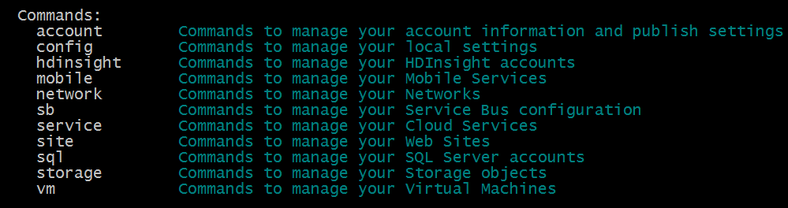

Entering the particular command will also bring up the usage for that area of the command line tools. Virtual Machines are particularly useful for DevOps scenarios and can easily be done through the x-plat CLI. The CLI makes it very easy to automate routine tasks with Virtual Machines using scripts. 

Lets create a new Virtual Machine. We will create an Ubuntu VM, in order to do so we need to find a VM image. We can fetch a list of available Virtual Machines by executing the command:

```batch
azure vm image list 
```

We will get back a big list of public VM images available from Azure. We should select a recent Ubuntu build:


In order to create a VM we need a datacenter location for the VM to live. To get a list of valid locations we can place our VM, execute this command:

```batch
azure vm location list
```

We can use this location as input to the **vm create** command to create a new VM:

```batch
azure vm create <yourdomainname> <imagename> <username> <password> --location '<selected datacenter region>'
```
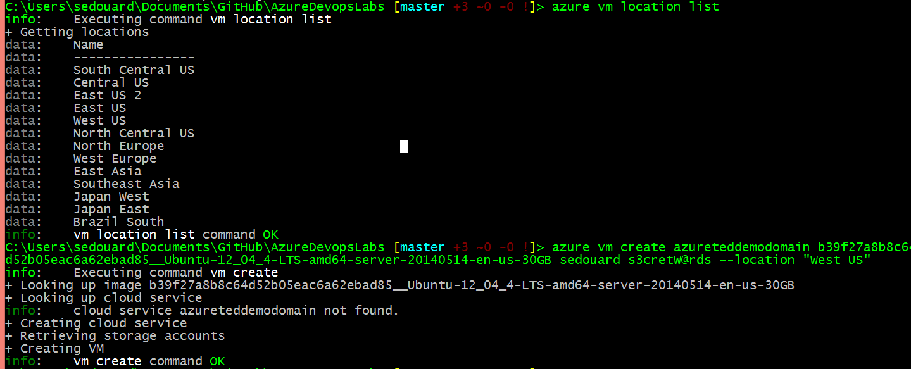

Using a the command line scripting tools available on the platform (usually Batch, Powershell or Bash) we can automate this process in whichever way is needed for your customized DevOps solution. For example, parsing the output of **vm location list** and feeding it into **vm create** can allow you to dynamically select the location of your VM. 

## Lab 2: Scripting away the setup of a Dev/Test Machines

The main purpose of the command line interface is to script away routine tasks required for for product development, testing or deployment. In this example we will create an [affinity group](http://social.technet.microsoft.com/wiki/contents/articles/7916.importance-of-windows-azure-affinity-groups.aspx), a [virtual network](http://azure.microsoft.com/en-us/services/virtual-network/) (vnet) and a set of linux VMs that will belong to the affinity group and vnet.

The scripting engine we will use will be Node.js itself. A veriety of options for scripting such as Bash, Batch, Powershell and Grep exist however this lab will use a simple library, [azure-scripty](http://npmjs.org/azure-scripty) to use the azure x-plat cli right from javascript.

To get started, from the **Start** folder in your repository, install the required packages (note: your repository should be at your drive root or very close to avoid path too long errors)
```
npm install
```

This will install azure-scripty, plus [async](http://npmjs.org/azure-scripty) to facilitate asynchonous tasks and [nconf](http://npmjs.org/nconf) to read configuration data out of a json file.

Next we will customize our [config.json](config.json) which defines many of the settings for our development setup that we will be creating.

```json
{
	"vnet_name":"<VIRTUAL_NETWORK_NAME>",
	"vm_count": "3",
	"vm_image_name": "<YOUR_DESIRED_VM_IMAGE>",
	"vm_base_name":"<YOUR_BASE_MACHINE_NAME>",
	"vm_username":"<YOUR_VM_USER_NAME>",
	"vm_password":"<YOUR_VM_PASSWORD>",
	"affinity_group":{
		"name":"<AFFINITY_GROUP_NAME>",
		"label":"<AFFINITY_GROUP_LABEL>",
		"location":"<DESIRED_LABEL>"
	}
}
```

Replace each of the values with the values you prefer. For the rest of this example, we will use the following filled out values:

```json
{
	"vnet_name":"azuretedvnet2",
	"vm_count": "3",
	"vm_image_name": "b39f27a8b8c64d52b05eac6a62ebad85__Ubuntu-14_04-LTS-amd64-server-20140416.1-en-us-30GB",
	"vm_base_name":"sedouardmachine",
	"vm_username":"sedouard",
	"vm_password":"p@assW0rd",
	"affinity_group":{
		"name":"azureteddemoaffinitygroup",
		"label":"sedouard",
		"location":"West US"
	}
}
```

The goal of our script will be to read these configuration values to create an affinity group named **azureteddemoaffinitygroup** with an associated virtual network named **azuretedvnet** and to attach 3 Ubuntu Virtual Machines to this network.

Take a look at [DevSetup.js](DevSetup.js) the way it is currently:

```js
//Bring in all required modules
var scripty = require('azure-scripty');
var nconf = require('nconf');
var async = require('async');

//Load configuration file
nconf.file({ file: 'config.json' });

```
**devsetup.js**

We have loaded up our configuration and now that the azure xplat cli is configured with our subscription we can simply start using it with azure-scripty. This libarary is really useful for calling any command on the azure command line. We will first start with the affinity group. We first want to check if an affinity group matching **affinity_group.name** in the **config.js** exists on our subscription. if it does not we should make it.

Let's start by creating a function, **createAffinityGroup** which lists out each affinity group on our account. If your account doesn't already have any affinity groups, there will be no output:

```js
//////////////////////////////////////////////////////////////////////////////
//Creates an affinity group if specified one doesn't exist
//////////////////////////////////////////////////////////////////////////////
function createAffinityGroup(cb) {
    console.log('Getting affinity groups...');
    scripty.invoke('account affinity-group list', function (err, result) {
        
        if (err) {
            return cb(err);
        }
        console.log('Current affinity groups');
        for (var i in result) {
            console.log(result[i].name);
        }
       
    });
    
}
//////////////////////////////////////////////////////////////////////////////
//Main Entry Point
//////////////////////////////////////////////////////////////////////////////
createAffinityGroup(function(err){

	if(err){
		return console.error(err);
	}

	return console.log('Success! Completed!');

});
```
**DevSetup.js**

[scripty.invoke](https://www.npmjs.org/package/azure-scripty) will simply execute the azure command, **azure account affinity group list**. The callback will be executed when the azure command completes and we will print out the currently available affinity groups.

Now, run DevSetup.js script and you should see the affinity groups in your subscription listed:

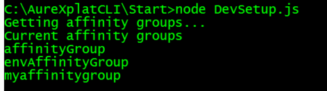

We want to check if the affinity group **azuretedvnet2** exists, if it does we are done with this step, otherwise we should create the affinity group. A bit of logic to check the output of the **account affinity-group list** command against the value of **affinity_group** in [config.json](config.json) will allow us to do this:

```js
var affinityGroup = nconf.get('affinity_group').name;
var label = nconf.get('affinity_group').label;
for (var i in result) {
    if (result[i].name === affinityGroup && result[i].label === label ) {
        //the affinty group to use in the config already exists
        return cb();
    }
}

console.log('Specified affinity group ' + affinityGroup + ' does not exist, creating new one...');
```
**DevSetup.js**

Now, let's execute the x-plat cli command **account affinity-group create** command. The azure-scripty library has a simple way to specify a command to invoke with positional and labeled parameters:

```js
// previous code hidden //

	//specify the cli command with the positional parameter of the affinityGroup name and labeled parameters of
	//location and label
	var cmd = {
            command: 'account affinity-group create',
            positional: [affinityGroup],
            location: '\"West US\"',
            label: label
        };

    scripty.invoke(cmd, function (err) {
        if (err) {
            cb(err);
        }
        return cb();
    });

// main entrypoint code hidden //
});
```
**DevSetup.js(snippet)**

Putting it all together, we have a script that will create the specified affinity group if it doesn't already exist:

```js
//Bring in all required modules
var scripty = require('azure-scripty');
var nconf = require('nconf');
var async = require('async');

//Load configuration file
nconf.file({ file: 'config.json' });

//////////////////////////////////////////////////////////////////////////////
//Creates an affinity group if specified one doesn't exist
//////////////////////////////////////////////////////////////////////////////
function createAffinityGroup(cb) {
    console.log('Getting affinity groups...');
    scripty.invoke('account affinity-group list', function (err, result) {
        
        if (err) {
            return cb(err);
        }
        console.log('Current affinity groups');
        for (var i in result) {
            console.log(result[i].name);
        }

        var affinityGroup = nconf.get('affinity_group').name;
        var label = nconf.get('affinity_group').label;
        for (var i in result) {
            if (result[i].name === affinityGroup && result[i].label === label) {
                //the affinty group to use in the config already exists
                return cb();
            }
        }
        
        console.log('Specified affinity group ' + affinityGroup + ' does not exist, creating new one...');
        var cmd = {
            command: 'account affinity-group create',
            positional: [affinityGroup],
            location: '\"West US\"',
            label: label
        };
        
        scripty.invoke(cmd, function (err) {
            if (err) {
                cb(err);
            }
            return cb();
        });
    });
}

//////////////////////////////////////////////////////////////////////////////
//Main Entry Point
//////////////////////////////////////////////////////////////////////////////
createAffinityGroup(function (err) {
    
    if (err) {
        return console.error(err);
    }
    
    return console.log('Success! Completed!');

});
```
**DevSetup.js**

Run [DevSetup.js](DevSetup.js) and you should see output similar to the following:

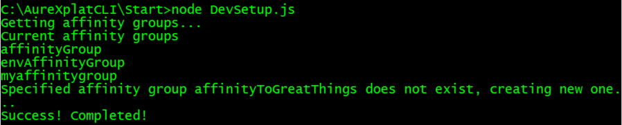

To confirm that the affinity group actually exist you can cross check this with the affinity groups listed on the portal:

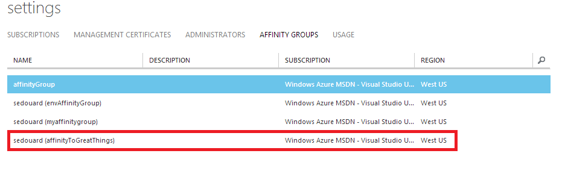

Now we have our script that will create an affinity group. Lets create a function that will create a virtual network that we will use to connect our VMs together. This function will follow a similar setup as **createAffinityGroup**. We first have to list out our virtual networks:

```js

// ... //

//Creates the config specified vnet, if it doesn't already exist
//////////////////////////////////////////////////////////////////////////////
function createVirtualNetwork(cb) {
    console.log('Getting networks...');
    scripty.invoke('network vnet list', function (err, result) {
        
        if (err) {
            return cb(err);
        }
        
        var networkName = nconf.get('vnet_name');
        
        for (var i in result) {
            console.log(result[i].name);
        }
    });
}

// ... //
```
**createVirtualNetwork(snippet)**
Running this function above will show you all the virtual networks currently created on your subscription:


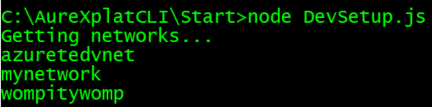

Now we will check if the vnet name specified in **vnet_name** in config.jason exists among the list of current virtual networks. if it does not exist, we will create a new one.

```js

// ... //

//////////////////////////////////////////////////////////////////////////////
//Creates the config specified vnet, if it doesn't already exist
//////////////////////////////////////////////////////////////////////////////
function createVirtualNetwork(cb) {
    console.log('Getting networks...');
    scripty.invoke('network vnet list', function (err, result) {
        
        if (err) {
            return cb(err);
        }
        
        var networkName = nconf.get('vnet_name');
        
        for (var i in result) {
            if (result[i].name === networkName) {
                //we have found that the speicfied vnet exists.
                return cb();
            }
        }
        
        console.log('Specified vnet ' + networkName + ' does not exist. Creating new one...');
        
        var cmd = {
            command: 'network vnet create',
            positional: [networkName],
            'affinity-group': nconf.get('affinity_group').name
        };
        
        scripty.invoke(cmd, function (err) {
            
            cb(err);
        
        });
    });
}

// ... //
```

Now running the entire function will create the virtual network with the name specified in config.json, if it doesn't already exist:


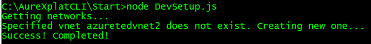

You can also confirm that the vnet was created in the portal:

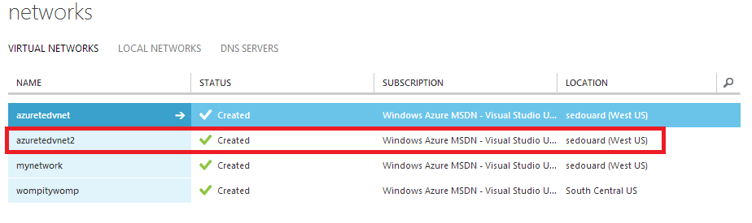

Lastly, we actually need to create our VM resources and have the associted with our Virtual Network and affinity group.

The field **vm_count** will specify the number of VMs we will create. The field **vm_base_name** will specify the prefix name fo the VM and **vm_count** specifies the number of VMs to create. So given the configuration:

```json
{
	"vnet_name":"azuretedvnet2",
	"vm_count": "3",
	"vm_image_name": "b39f27a8b8c64d52b05eac6a62ebad85__Ubuntu-14_04-LTS-amd64-server-20140416.1-en-us-30GB",
	"vm_base_name":"sedouardmachine",
	"vm_username":"sedouard",
	"vm_password":"p@assW0rd",
	"affinity_group":{
		"name":"affinityToGreatThings",
		"label":"sedouard",
		"location":"West US"
	}
}
```

we will have the VMs named, **sedouardmachine0**, **sedouardmachine1**, **sedouardmachine2** each attached to the azuretedvnet2 vnet.

We first need a function that will simply print out all of our available VMs:

```js
// ... //

//////////////////////////////////////////////////////////////////////////////
//Creates the specified number of virtual machines, if they don't exist
//////////////////////////////////////////////////////////////////////////////
function createVirtualMachines(count, cb) {
    
    console.log('Getting list of virtual machines...');
    
    //first get the list of existing VMs on this sub
    scripty.invoke('vm list', function (err, result) {
        
        if (err) {
            return cb(err);
        }
        
        for (var i in result) {
            
            console.log(result[i].VMName);
        }
    });
}

// ... //

var vmCount = nconf.get('vm_count');
createVirtualMachines(vmCount, function (err) {
    
    if (err) {
        return console.error(err);
    }
    
    console.log('Succeeded');
});
```

Running the above code snippet will give us the list of existing VMs on our azure subscription:

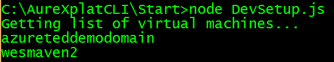

Similar to the above operations we need to compare the list of existing VMs to the set of new VMs we will create. We will do this by computing all the VM names to be created and placing them into an array. 

With the given [config.json](config.json) we will have an array of the VM names, **["sedouardmachine0", "sedouardmachine1", "sedouardmachine2"]**. We will check if any of these machines exist, if they do we will remove them from the array and then take any left over names in the array and use that to create a new VM.

```js
scripty.invoke('vm list', function (err, result) {
    
        if (err) {
            return cb(err);
        }
        
        var baseName = nconf.get('vm_base_name');
        
        var vmNames = [];
        
        //create the array of the computed VM names
        for (var z = 0; z < count; z++) {
            vmNames.push(baseName + z.toString());
        }
        
        //go through the list of existing vms
        for (var i in result) {
            
            for (var k in vmNames) {
                
                if (result[i].VMName === vmNames[k]) {
                    //A VM we intend on creating already exists on this sub.
                    //remove it on the list of VMs to create
                    delete vmNames[k];
                }
            }
        }
        
        //vmNames now only contains the name of VMs that do not exist
        //create them
```

Now our array **vmNames** contains only the VMs we intend on creating (and nulls where we don't). Now we just need to iterate through this array to decide which VMs to create. For each VM we decide to create we will create a task that we will execute with the [async](http://npmjs.org/async) library.

```js
// ... //
		//vmNames now only contains the name of VMs that do not exist
        //now create them!
        
        var domainName = nconf.get('dns_name');
        var userName = nconf.get('vm_username');
        var password = nconf.get('vm_password');
        var imageName = nconf.get('vm_image_name');
        var vmCreationTasks = [];
        var taskArguments = [];
		
		//go through the VM names we intend on making
        for (var m in vmNames) {
            
            if (vmNames[m]) {
				//issue the vm create azure cli command
                var cmd = {
                    command: 'vm create',
                    positional: [vmNames[m], imageName, userName, password],
                    'affinity-group': nconf.get('affinity_group').name,
                    'virtual-network-name': nconf.get('vnet_name')
                }
                
                var task = function (args, cb) {
                    console.log('Creating vm ' + vmNames[args[0]]);
                    scripty.invoke(args[1], function (err) {
                        
                        if (err) {
                            return cb(err);
                        }
                        
                        console.log('vm creation of ' + vmNames[args[0]] + ' successful');
                        cb();
                    });
                }
                
				//bind and add this function to a list we will execute serially
                task = task.bind(this, [m, cmd]);
                vmCreationTasks.push(task);
            }
        
        }

// ... //
```

Now that we have an array of VM creation tasks we will execute them serially. Note: as of writing this, the x-plat CLI will not allow the parallel creation of Virtual Machines:

```js
 //execute VM creation commands serially
 async.series(vmCreationTasks, function (err) {
        
            if (err) {
            
                return cb(err);
            
            }
            
            console.log('All VMs created successfully!');
            cb();
		}
 );

```

Putting it all together, we have our entire **createVirtualMachine** function:

```js

function createVirtualMachines(count, cb){

    console.log('Getting list of virtual machines...');

    scripty.invoke('vm list', function (err, result) {
    
        if (err) {
            return cb(err);
        }
        
        var baseName = nconf.get('vm_base_name');
        
        var vmNames = [];
        
        //create the array of the computed VM names
        for (var z = 0; z < count; z++) {
            vmNames.push(baseName + z.toString());
        }
        
        //go through the list of existing vms
        for (var i in result) {
            
            for (var k in vmNames) {
                
                if (result[i].VMName === vmNames[k]) {
                    //A VM we intend on creating already exists on this sub.
                    //remove it on the list of VMs to create
                    delete vmNames[k];
                }
            }
        }
        
        //vmNames now only contains the name of VMs that do not exist
        //create them
        
        var domainName = nconf.get('dns_name');
        var userName = nconf.get('vm_username');
        var password = nconf.get('vm_password');
        var imageName = nconf.get('vm_image_name');
        var vmCreationTasks = [];
        var taskArguments = [];

        for (var m in vmNames) {
            
            if (vmNames[m]) {
                var cmd = {
                    command: 'vm create',
                    positional: [vmNames[m], imageName, userName, password],
                    'affinity-group': nconf.get('affinity_group').name,
                    'virtual-network-name': nconf.get('vnet_name')
                }
                
                var task = function (args, cb) {
                    console.log('Creating vm ' + vmNames[args[0]]);
                    scripty.invoke(args[1], function (err) {
                        
                        if (err) {
                            console.log('Vm creation failed: ' + vmNames[args[0]]);
                            return cb(err);
                        }
                        
                        console.log('vm creation of ' + vmNames[args[0]] + ' successful');
                        cb();
                    });
                }
                
                task = task.bind(this, [m, cmd]);
                vmCreationTasks.push(task);
            }
        
        }

        async.series(vmCreationTasks, function (err) {
        
            if (err) {
            
                return cb(err);
            
            }
            
            console.log('All VMs created successfully!');
            cb();
        })

    });

}
```


Running just this function will result in 3 Virtual Machines created. Depending on the **vm_image_name** and **vm_count** fields in config.json will result in a variable number of Linux or Windows VMs:

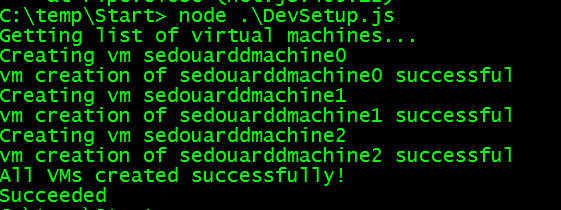

We can confirm that the VMs have been created in the Azure Portal:

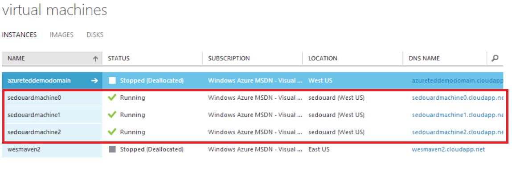

Finally we just need to call **createAffinityGroup**, **createVirtualNetwork** and **createVirtualMachines** in order to ensure our setup is created correctly:

```js

//////////////////////////////////////////////////////////////////////////////
//Main Entry Point
//////////////////////////////////////////////////////////////////////////////
createAffinityGroup(function (err) {
    if (err) {
        return console.error(err);
    }
    
    createVirtualNetwork(function (err) {
        
        if (err) {
            return console.error(err);
        }
        var vmCount = nconf.get('vm_count');
        createVirtualMachines(vmCount, function (err) {
            
            if (err) {
                return console.error(err);
            }
            
            console.log('Succeeded');
        });
        
    });
});

```

You can find the full source code [here](End/DevSetup.js)

## Conclusion

Using the Azure Cross Platform CLI is an easy way to automate DevOps infrastructure and platform services desipite dev teams having a heterogenous environment (Mac, Linux, PC). Using a library like [azure-scripty](http://npmjs.org/azure-scripty) allows for javascript scripting of tasks however other popular scripting engines like Batch, Bash and Powershell may just as easily be used.
