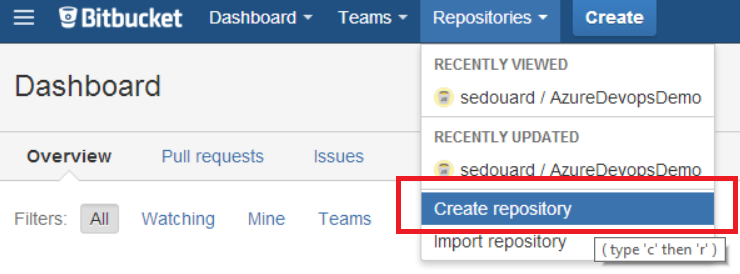
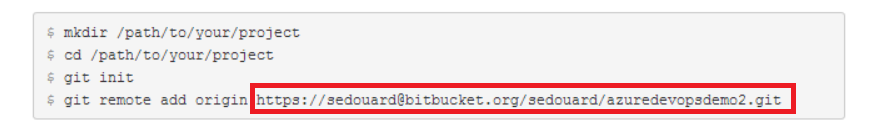
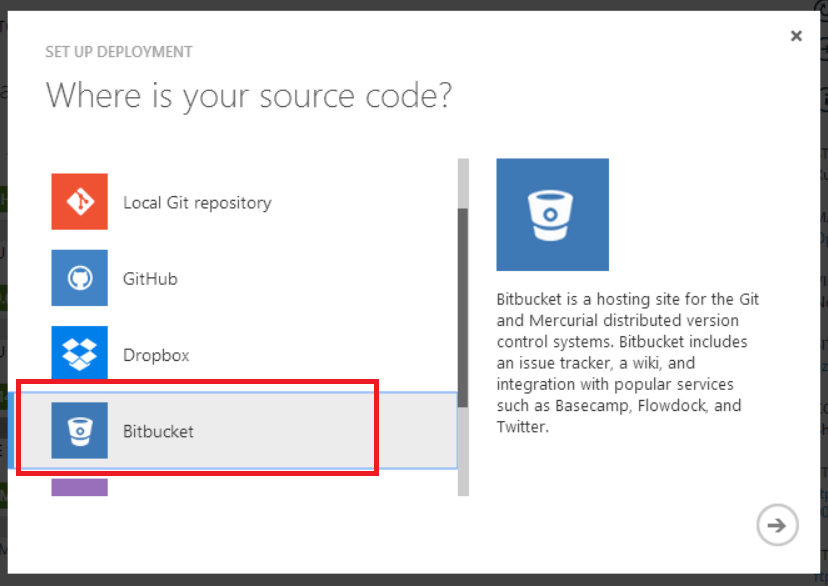
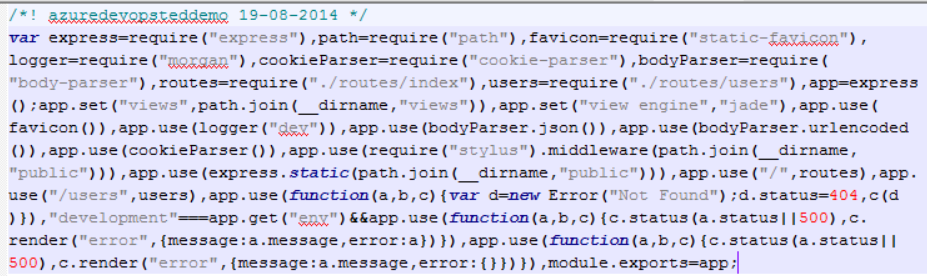
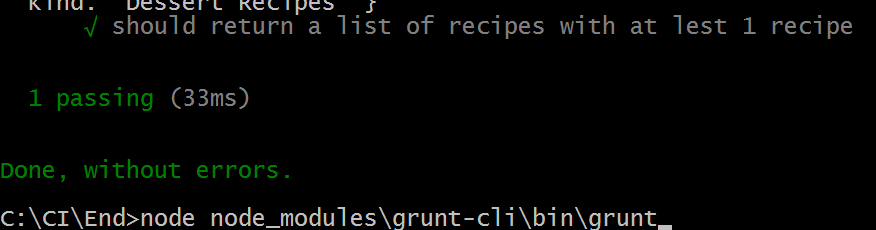
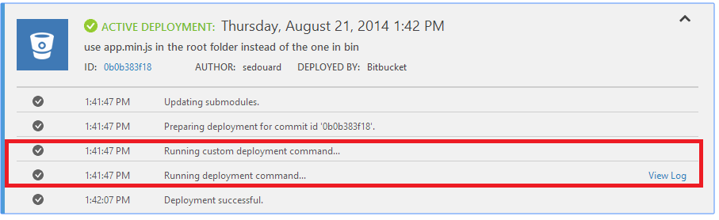
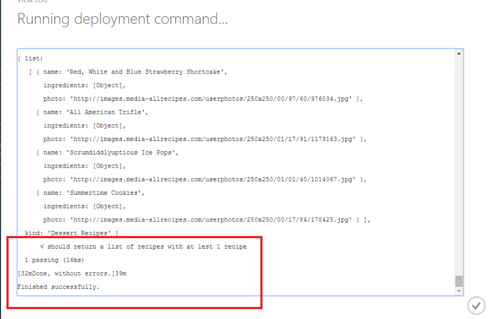
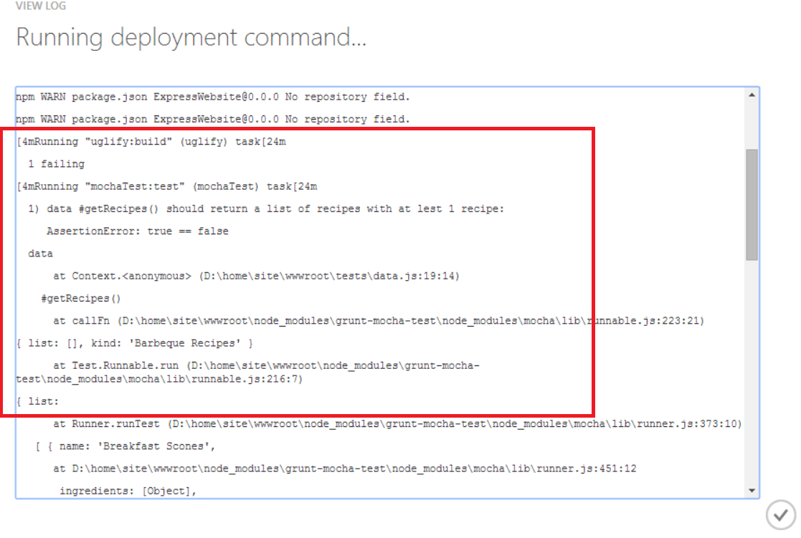
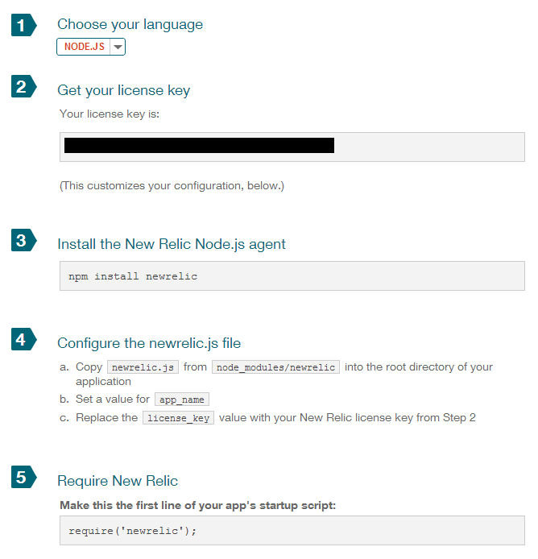

# Azure Dev Ops: Continuous Delivery with Azure Websites and Atlassian

----------

## Objectives

By the end of this lab you will know:

- How set up Continuous Delivery from a 3rd party source control service provider
- Run Continuous Integration Builds and Tests with Azure Websites
- Associate build breaks with commits and team members

## Compete Services: Atlassian

Atlassian is a complete Cloud DevOps platform. Atlassian offers a host of rich Devops and Application Lifecycle Management tools such as:

- Source Control with Bitbucket
- Continuous Integration Builds and Deployments with Bamboo
- Issue tracking with JIRA
- Collaboration platform with <Insert Atlassian Service Name here>

Atlassian has a suite of Software-as-a-Service products which you can use for most Dev Ops scenarios including collaboration and project management services.

Although Atlassian is a compete service to Visual Studio Online it has integration points which can be used with Azure.

### Lab 2: Continuous Deployment using Bitbucket and Azure Websites


One of the most basic DevOps scenarios is to be able to deploy your application from either your development or production environment to your live Website upon committing code to the repository. This process is called Continuous Integration or Continuous Delivery.

[Bitbucket](http://www.bitbucket.com) and other source control services such as [Github](www.github.com) provide web hooks from their platform to deploy code bases to cloud services like Azure Websites.  

In this demo we will deploy [Node Recipes](http://noderecipes.azurewebsites.net), a simple Node.js application to Azure via Bitbucket Git repository. The first step is copy the **Start** folder and place it in your directory root. Then install the required packages:

```batch
Start> npm install
```

If you haven't already [signed up for a free BitBucket account](https://bitbucket.org/account/signup/), now is a good time to do so. In the Bitbucket dashboard, we will create a new repository to host our website:




Now that we have our repository, in your local website folder, initialize a new repository and set the remote to the BitBucket remote repository which you can find in the Bitbucket dashboard:




```bash
# Create a blank repository
git init
# Add all the files in the folder to the repo
git add .
# Commit to the local repository
git commit .
# Now add the BitBucket remote repostiory (Bitbucket password required)
git remote set-url origin https://<USER NAME>@bitbucket.org/<OWNER NAME>/<REPOSITORY NAME>.git
```

Now, before pushing to our repository we will hook up an Azure Website to the BitBucket URL. This is no different than how you would do this for Github or Visual Studio Online. Start by heading to your website portal and click '**Setup deployment from source control**'


This will give you a variety of popular source control providers. This is the same process you would go through for Github or Visual Studio Online. Select Bitbucket and enter your credentials. 




Azure will authenticate to Bitbucket and you can select the repository of choice. Select the repository and branch with your node.js website you wish to deploy:


Now, because we haven't pushed to our repository, there won't be any deployments and your website will just have a blank placeholder:


If we go back to our console and push our commit to the repository, we will trigger the first deployment of the web service:

```bash
# Push commit to remote repository in Bitbucket
git push origin master
```

Now if you go back to the 'Deployments' tab in the website you'll notice a new deployment is in process:


Afterwards the deployment becomes active and browsing the site gets. Notice on the deployment item, we can see the author that triggered the deployment and the commit ID. You will also notice that we have a deployment script and some output:


Clicking on the commit ID will show you the commit in Bitbucket:


In the next lab we'll look at how to do continuous integration tests through Azure Websites

### Lab 3: Running Build Tasks Within Azure Websites

The most important thing in Continuous Integration is running builds and test passes upon check-in. A really cool feature of Azure websites is the ability to run custom scripts upon deployment. This gives us the opportunity to utilize the compute in azure websites for devops purposes.

We will use [grunt](http://gruntjs.com) as our task engine for our node.js website. If you were doing an ASP.net website you could use the %MSBUILD_PATH% environment variable in your script. For this example we will do a simple minify of our app.js file. First, let's install grunt, and [uglify](https://github.com/mishoo/UglifyJS), a grunt plugin that will minify our javascript files.

```bash
#install grunt, grunt-cli and uglify and record them as development dependencies
npm install grunt-cli --save-dev
npm install grunt --save-dev
#install uglify grunt plugin
npm install grunt-contrib-uglify --save-dev
```

Now we can add the following Grunt.js file to the root directory of our website:

```js

///////////////////////////////////////////////////////////
///Main Grunt wrapper function
///////////////////////////////////////////////////////////
module.exports = function(grunt) {

  //initConfig will take our configuration object. This specifies which tasks
  //and plugins we want to use
  grunt.initConfig({
    pkg: grunt.file.readJSON('package.json'),
	//specify that we would like to use the uglify plugin with the build and option parameters
    uglify: {
      options: {
		//places a timestamp on top of our minified file
        banner: '/*! <%= pkg.name %> <%= grunt.template.today("dd-mm-yyyy") %> */\n'
      },
      build: {
		//specifies source file(s) and destination.
        src: 'app.js',
		dest: 'app.min.js'
      }
    }
  });

	
  ///////////////////////////////////////////////////////////
  ///Load the uglify and mocha plugins and set it 
  ///as the default task
  ///////////////////////////////////////////////////////////
  grunt.loadNpmTasks('grunt-contrib-uglify');

  grunt.registerTask('default', ['uglify']);

};
```
**GruntFile.js**

Now, we will make a minor code change in the **packages.json** file, to change the main entry point from app.min to app.min.js.

```json
{
  "name": "ExpressWebsite",
  "version": "0.0.0",
  "description": "Azure TED Continous Integration Demo",
  "main": "app.min.js",
  "author": {
    "name": "sedouard",
    "email": ""
  }
```

To confirm our changes work locally, run Grunt locally:

```bash
# This will run the default task from GrunFile.js
grunt
```
You should get output similar to the following:


Now the minified app.min.js will be sitting in the root repository folder:



We can also add some tests to our website. The NodeRecipes app, uses static data in the javascript file [tests/data.js](tests/data.js). We can test this data file by using the [mocha](http://visionmedia.github.io/mocha/) test harness and running it with the [mocha plugin for grunt](https://www.npmjs.org/package/grunt-mocha-test). 

We'll install mocha and the grunt plugin for mocha

```batch
REM Install mocha and mocha plugin for grunt
npm install mocha --save-dev
npm install grunt-mocha-test --save-dev
```

First we can add the unit test that will validate we have at least one recipe for each category:

```js
var assert = require("assert");
var data = require('../data/recipesData.js');

////////////////////////////////////////////////////////////////////////////////
//Sample tests for Continuous Integration for the data source
///////////////////////////////////////////////////////////////////////////////
describe('data', function(){
  describe('#getRecipes()', function(){
    it('should return a list of recipes with at lest 1 recipe', function(){
      var bbqRecipes = data.getRecipes('bbq');
      var brunchRecipes = data.getRecipes('brunch');
      var dessertRecipes = data.getRecipes('dessert');

      console.log(bbqRecipes);
      console.log(brunchRecipes);
      console.log(dessertRecipes);
      
      var result = bbqRecipes.list.length > 0;

      assert.equal(true, result);
    })
  })
})
```
**[tests\data.js](End\tests\data.js)**

Assuming we place this file in **tests\data.js** we can add the mocha tests to our grunt task file:

```js
///////////////////////////////////////////////////////////
///Main Grunt wrapper function
///////////////////////////////////////////////////////////
module.exports = function(grunt) {

  //initConfig will take our configuration object. This specifies which tasks
  //and plugins we want to use
  grunt.initConfig({
    pkg: grunt.file.readJSON('package.json'),
	//specify that we would like to use the uglify plugin with the build and option parameters
    uglify: {
      options: {
		//places a timestamp on top of our minified file
        banner: '/*! <%= pkg.name %> <%= grunt.template.today("dd-mm-yyyy") %> */\n'
      },
      build: {
		//specifies source file(s) and destination.
        src: 'app.js',
		    dest: 'app.min.js'
      }
    },
    mochaTest: {
      test: {
        options: {
          reporter: 'spec'
        },
        src: ['tests/**/*.js']
      }
    }
  });

	
  ///////////////////////////////////////////////////////////
  ///Load the uglify plugin and setting it as the default task
  ///////////////////////////////////////////////////////////
  grunt.loadNpmTasks('grunt-contrib-uglify');
  grunt.loadNpmTasks('grunt-mocha-test');
  grunt.registerTask('default', ['uglify', 'mochaTest']);

};

```

Running grunt again will show that the unit tests run now:

```batch
node node_modules\grunt-cli\bin\grunt
```


We've verified our Grunt task works as expected. Now lets add that step to a custom deployment script. In order to do this we need to use the azure x-plat CLI to create a custom build script for us. Execute the following command from your the root of your directory:

```bash
# Create a default deployment script for Node.js. The last '.' is the location of the root 
# of the website which is the root of this repository. 
# The output will be deploy.cmd and .deployment. The first contains the deployment commands
# while the latter contains the name of the script file to run for deployment (deploy.cmd)
azure site deploymentscript --node --sitePath .
```

This command generates two files:


- **.deployment** - This file contains the command that will be executed by the deployment mechanism (kudu)
- **deploy.cmd** - This is the batch file that will be executed. This can be be a bash script or a javascript file.


Now, lets add this snippet of batch script after the Deployment banner step 3. Note this script can actually be written in Bash or Javascript as well:

```batch
::::::::::::::::::::::::::::::::::::::::::::::::::::::::::::::::::::::::::::::::::::::::::::::::::::::::::::::::::::::::::::::::::
:: Deployment
:: ----------

:: 4. Build & Test
pushd %DEPLOYMENT_TARGET%
call :ExecuteCmd !NPM_CMD! install --development
call :ExecuteCmd "%NODE_EXE%" node_modules\grunt-cli\bin\grunt
IF !ERRORLEVEL! NEQ 0 goto error
```

In the script above, **NODE_EXE** is the pointer to the node executable and **NPM_CMD** is the pointer to node package manager. These environment variable is provided by Azure Websites.

Commit and push your repository, triggering another deployment. After the deployment is complete, we can see the deployment log on Bitbucket indicates that our build ran successfully:




We can cause the build to fail by removing all of the recipes from one category in **[data\recipeData.js](data\receipeData.js)**:

```js
// ... //

var data = {
    bbq : [
        // Blank BBQ list. Should cause build failure on unit tests
    ],
    brunch : [
    {
        name: 'Breakfast Scones',
        ingredients: ["1 pound boneless pork loin or tenderloin",
                "1 Onion",
                "1 Zuchhini",
                "1 Shitake Mushroom"
            ],
        photo : 'http://images.media-allrecipes.com/userphotos/250x250/00/01/71/17102.jpg'
        },

// ... //
```

In the code above all the BBQ recipes are missing. Now commit and push the changes. When the deployment is triggered by Azure, we'll see that the deployment fails with the commit that causes the failure, the author, (we can get more detail by clicking on the Bitbucket commit link) and the exact failure output:




We can clearly see that the test which checks if each recipe list has at least 1 recipe fails and that we should fix it

With custom deployment scripts you can run any batch, bash or javascript file upon deployment to define your custom deployment steps. These steps can include building and running validations. Every deployment has an author, commit ID and a result. This enables for fast continuous integration among a development team by providing scalable dev/test resources right from the environment they will be deploying to production.

## Application Telemetry

Post-deployment is critical in gaining feedback from your application. A variety of solutions exist to collect information about your applications usage and performance while in production. This lab will cover New Relic a popular application telemetry service which integrates to most platforms. The very nice thing about New Relic is that it integrates to Azure Websites really easily.

To activate new relic, first you need to [sign up for a free New Relic account](http://newrelic.com/). You will be provided an API key on your New Relic portal with a few really simple steps to get going. Just copy the newrelic.js file out of the modules folder and place it into the root repository. Give your app a name and enter your license key:



After you make the code edits, commit and push your changes. The website will deploy to Azure with New Relic setup for application telemetry. After a few minutes, New Relic will detect your application. To drive some traffic to the website you can use [loadimpact.com](http://loadimpact.com) to run a simple load test, just point it to the azure website. After a bit you'll have data coming in to your New Relic portal:


In our next lab we will use Visual Studio Online to launch a load test for our website and use New Relic to understand how it impacts our application.