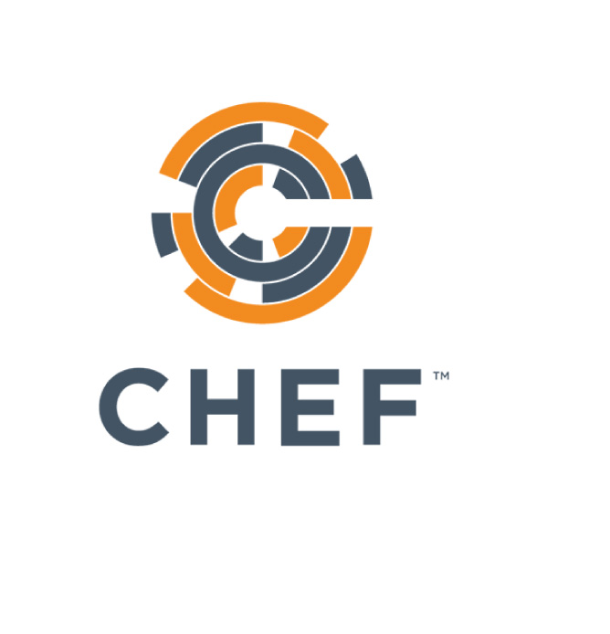
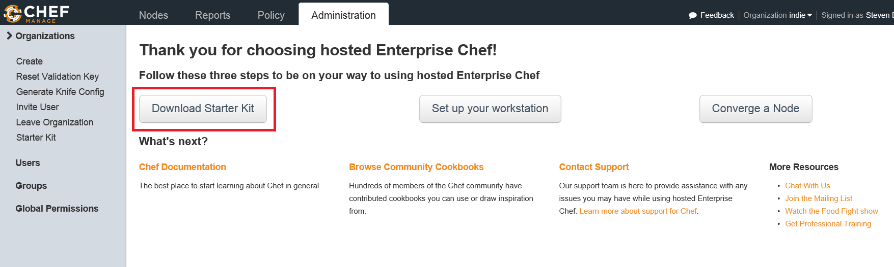
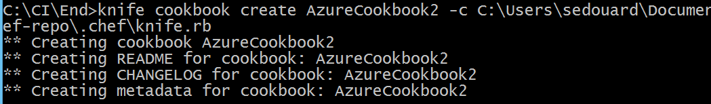
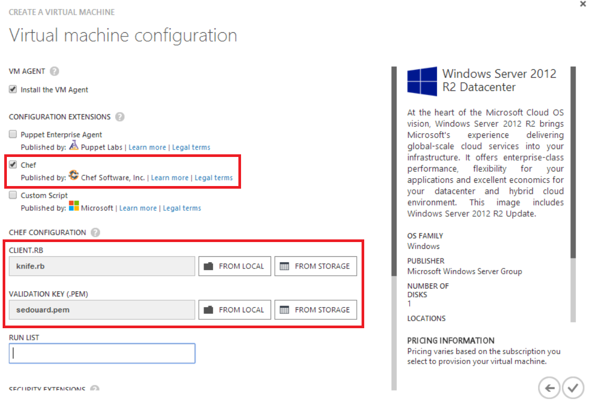
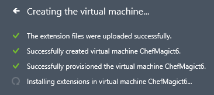

# Auto-Configuring A Virtual Machine With Chef

## Objectives

By the end of this lab you will:

- Understand how 3rd party IT Automation framework integrates with Azure
- Be able to setup a Virtual Machine


## Introduction



Chef is an IT automation framework which is popular with many Linux administrators to automate the setup of servers. Microsoft Open Tech has partnered with Chef to create [Knife](http://docs.getchef.com/plugin_knife_azure.html) an extension for chef which allows the management of Windows Machines with Azure.

## Getting setup

In this lab we will provision a Virtual Machine with Apache using Chef. In order to complete this lab a you need to [sign up for a free hosted chef account](http://getchef.com).

Start from the **Start** folder in this repository.

After signing up for Chef, you need to download your Start kit which includes some account keys that you will need to access your chef account. These account keys allow you to store Chef cookbooks which is what is used in Chef automation. You can find this under the **Administration Tab ** under the Starter Kit section:



This will download a .zip package which you should save and extract to somewhere safe.

In order to use Knife, the Chef client for Windows, you must [install Ruby](http://rubyinstaller.org/). The version of Ruby must be greater than or equal to version 1.9.3.

Now, to install Knife, you can use the [**gem**](http://rubygems.org) package manager to install Knife. (this may take a few minutes)

```batch
gem install knife-azure
```

Now we are setup to start creating cookbooks

## Setting up the configuration file

After installing Knife, you need to set your configuration file to point to the cookbooks in your repository. (The **Start** folder if you started from there). We get this configuration file from the Start Kit we downloaded in the previous section under **.chef/knife.rb**


```rb
# See http://docs.getchef.com/config_rb_knife.html for more information on knife configuration options

# We will use this version in Azure
current_dir = File.dirname(__FILE__)
log_level                :info
log_location             STDOUT
node_name                "sedouard"
client_key               "#{current_dir}/sedouard.pem"
validation_client_name   "indie-validator"
validation_key           "#{current_dir}/indie-validator.pem"
chef_server_url          "https://api.opscode.com/organizations/indie"
cache_type               'BasicFile'
cache_options( :path => "#{ENV['HOME']}/.chef/checksums" )
cookbook_path            ["#{current_dir}/../cookbooks"]
```

By default it is set to have the your cookbooks within the root folder of the starter kit. However, the cookbooks you will need are inside your **Start** folder. So change the **cookbook_path** variable to point to your **Start** folder


```rb
# See http://docs.getchef.com/config_rb_knife.html for more information on knife configuration options

# !!!!SAVE THIS VERSION AS A COPY !!!
current_dir = File.dirname(__FILE__)
log_level                :info
log_location             STDOUT
node_name                "sedouard"
client_key               "#{current_dir}/sedouard.pem"
validation_client_name   "indie-validator"
validation_key           "#{current_dir}/indie-validator.pem"
chef_server_url          "https://api.opscode.com/organizations/indie"
cache_type               'BasicFile'
cache_options( :path => "#{ENV['HOME']}/.chef/checksums" )
cookbook_path            ["C:/Users/sedouard/Documents/GitHub/AzureDevopsLabs/Chef/start"]
```
**Note:** Be sure to save this as a COPY of your configuration file. We will use the original for our Azure VM and its very imporatant that you preserve that version.

Now we will create our own cookbook which will install Apache and set it up to run a simple web page. We will specify the **-c** argument which points to our configuration file.

```
Knife cookbook create AzureCookbook -c C:\Users\sedouard\Documents\chef-repo\.chef\knife.rb
```



Now we will modify **AzureCookbook2\recipes\default.rb** to install apache for Windows and tell it to start up a default web page we will soon set.

```rb
# This line will install Apache2 from the current source on internet
windows_package 'apache2' do
    source 'http://apache.osuosl.org//httpd/binaries/win32/httpd-2.0.65-win32-x86-openssl-0.9.8y.msi'
    action :install 
end


# Copy the configuration file for apache in the right location 
cookbook_file 'C:/Program Files (x86)/Apache Group/Apache2/conf/httpd.conf' do
    source 'httpd.conf'
end


# Install Apache as a service on Windows using the command line
windows_batch "ApacheAsService" do
    code <<-EOH
    "C:\\Program Files (x86)\\Apache Group\\Apache2\\bin\\Apache.exe" -k install
    EOH
end


# Create the file from a template that will be home page of our site
template "C:/Program Files (x86)/Apache Group/Apache2/htdocs/index.html" do
    source "index.html.erb"    
end


# Enable Port 80 on the Firewall of the VM
powershell_script "FWPort80" do
    code <<-EOH 
    New-NetFirewallRule -DisplayName "Allow Apache" -Direction Inbound -Program "C:\\Program Files (x86)\\Apache Group\\Apache2\\bin\\Apache.exe"
    EOH
end


# Ensure that the apache service is started 
service "Apache2" do
    action :start 
end

```

We need to create the HTML Rails template. **AzureCookbook2\templates\default\index.html.erb**. This template will display some basic information about the server:


```html

<html>
     <body>
        <h1> Welcome to My Demo </h1>
        <h2> Hello, <%= node["fqdn"]%> !</h2>
        <P>
            This server has <%= node["kernel"]["cs_info"]["total_physical_memory"].to_i / 1048576 %> MB of memory.
        </P>
     </body>    
</html> 

```

We will also set a file called **AzureCookbook2\files\default\httpd.conf** which will set the basic configuration of the apache server

```conf

ServerRoot "c:/Program Files (x86)/Apache Group/Apache2"
ServerAdmin test@demo.com
ServerName AzureVM1:80

```

The last thing we need to do is indicate our cookbook takes a dependency on the **windows** cookbook by noting it in **AzureCookbook2\metadata.rb**:

```rb
depends 'windows'
```

Now we need to upload the windows cookbook and the AzureCookbook2 cookbooks to our Chef account:

```batch
knife cookbook upload chef_handler -c C:\Users\sedouard\Documents\chef-repo\.chef\knife.rb
knife cookbook upload windows -c C:\Users\sedouard\Documents\chef-repo\.chef\knife.rb
knife cookbook upload AzureCookbook2
```

## Start the Azure VM with Automatic Installation and Setup from Chef

Now that we have our cookbooks uploaded we can start a new VM with Chef installed and AzureCookbook2 executed. Under the **Configuration Extensions** section in the last page of the Virtual Machine Configuration Wizard in the portal:

 

You can use the same exact kinfe.rb from your **.chef** folder in your Starter Kit you downloaded from chef. 

Now, start the creation of the VM. The VM will go through the typical provisioning steps and also have a new *extensions* step where it will install chef and run the Chef cookbook:




Now, if you check the dashboard of the VM under the extensions section you will see a bit of output from Chef which shows that the chef client installed correctly and executed the cookbook:

!!!SCREENSHOT PLACEHOLDER !!!


Now navigate to **YOUR_VIRTUAL_MACHINE_NAME.cloudapp.net** and you will see that your apache server is running.

Head over to your Chef management portal and you will see a new **node** has appeared. This indicates that you Chef enabled server is now reporting to your Chef account:


!!! SCREENSHOT PLACEHOLDER !!! 


Congrats! You have created an Azure Virtual Machine configured by Chef!