<a name="LoadTesting" />
# Load Testing Web Applications with Visual Studio Online #

---
<a name="Overview" />
## Overview ##

In this demo, you will learn how to use **"Visual Studio Ultimate"** and **"Visual Studio Online"** to Load Test a Web Application.

<a id="goals" />
### Goals ###
In this demo, you will see how to:

1. Create a **"Web Performance Test"** using **"Visual Studio 2013 Ultimate"**
1. Create a **"Load Test"** using **"Visual Studio 2013 Ultimate"**
1. Collect web application performance metrics from Application Insights during load testing.
1. Run your load test using **"Visual Studio Online"**

<a name="technologies" />
### Key Technologies ###

- [Visual Studio Online](http://www.visualstudio.com/)
- [Application Insights](http://msdn.microsoft.com/en-us/library/dn481095.aspx)
- [Web Performance and Load Tests](http://msdn.microsoft.com/en-us/library/dn250793.aspx)

<a name="Setup" />
### Setup and Configuration ###

1. The Web Performance and Load Tests run in this demo require that you have **Visual Studio 2013 Ultimate**.  You must have the Ultimate edition to do the demo. If you don't have Ultimate, you can get an eval copy from: http://go.microsoft.com/?linkid=9832446&clcid=0x409 

1. This demo requires that the **"Web Test Recorder"**.  To Ensure that it is enabled:
	- Open Internet Explorer, click on the **"Tools"** (**Gear**) icon in the top right corner, and select **"Manage add-ons"** from the pop-up menu:

		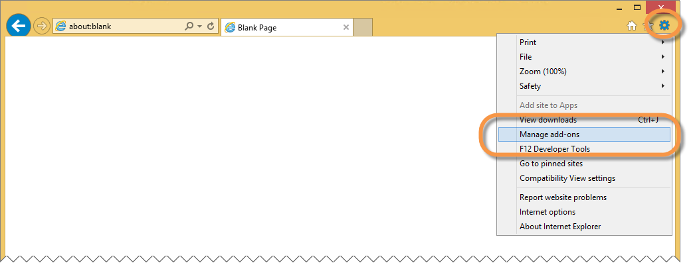

	- In the **"Manage Add-ons"** window, select the entry for the **"Microsoft Web Test Recorder 12.0 Helper"**, and if it's status is **"Disabled"**, click the **"Enable"** button.  

		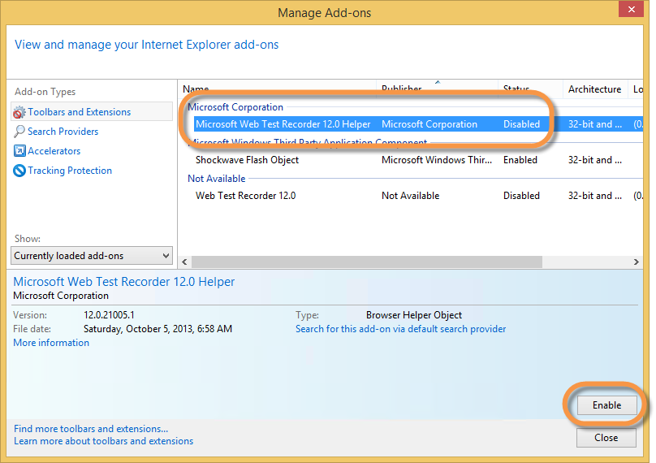

	- If prompted, turn on the **"Web Test Recorder 12.0"** checkbox, and click **"Enable"**

		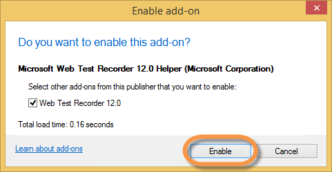

	- You can close the **"Manage Add-ons"** window and IE when you are done.

1. It is also especially helpful if you have a functioning completed version of the tests in this lab that you can use should the test you configure during the demo fail for some reason. 

<a name="Demo" />
## Demo ##
This demo is composed of the following segments:

1. [Create and run a Web Performance Test](#WebPerformanceTest)
1. [Create a Load Test](#LoadTest)
1. [Run the Load Test using Visual Studio Online](#RunLoadTestOnVSO)

---

<a name="WebPerformanceTest" />
### Create and run a Web Performance Test ###

1. If necessary createa a new Web Performance Test project in Visual Studio under the C# Templates

1. In the **Visual Studio** **"Solution Explorer"** window, expand the **&lt;Your Project Name&gt;.Tests** project.  Then, right click on the **&lt;Your Project Name&gt;.Tests** project, and select **"Add"** | **"Web Performance Test"** from the pop-up menu:

	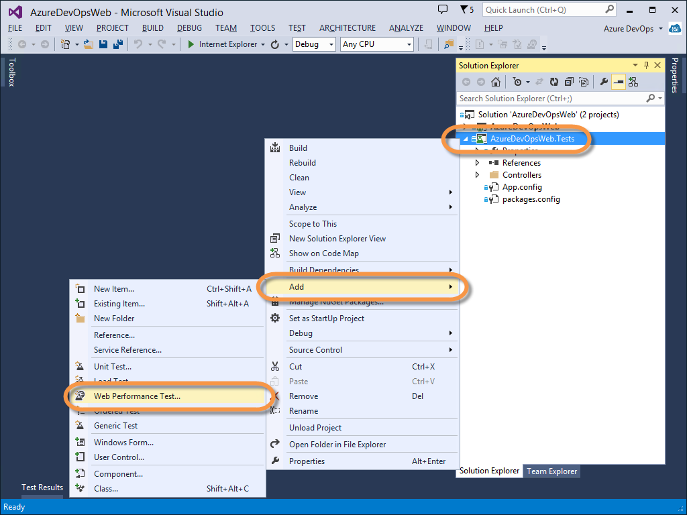

1. A **"Web Performance Test"** named **"WebTest1"** (or **"WebTest_n_"** where _n_ is some number) will be added to the project.  You can rename the WebTest later, but for now, we'll leave it as is. 

1. It should also open Internet Explorer with the **"Web Test Recorder"** plug-in open (if the **"Web Test Recorder"** doesn't appear, ensure that you enabled it as described in **"[Setup](#Setup)"** above).

	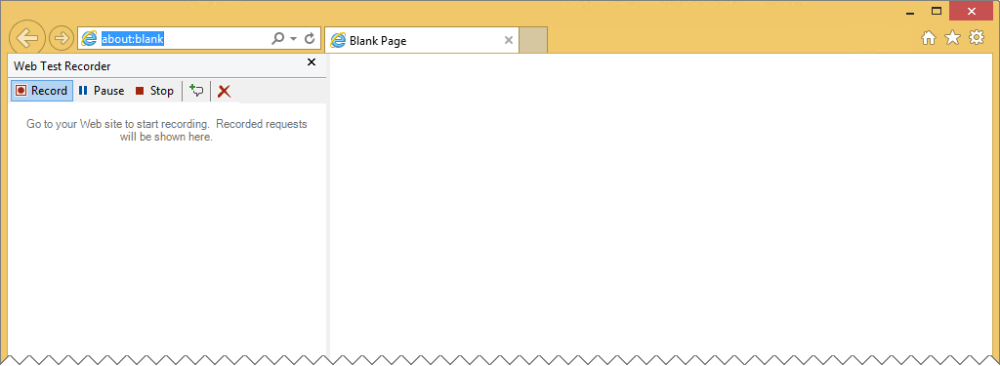

1. In the browser's address bar, enter the URL to the live web site you published previously.  Notice that when you navigate to the address, the address is added to the **"Web Test Recorder"** window"

1. Use the links along the top of the website (or by clicking on the **"Hamburger Button"** if needed) to navigate to the each recipe tab.  Finally, click the **"Stop"** button along the top of the **"Web Test Recorder"** to stop recording:

	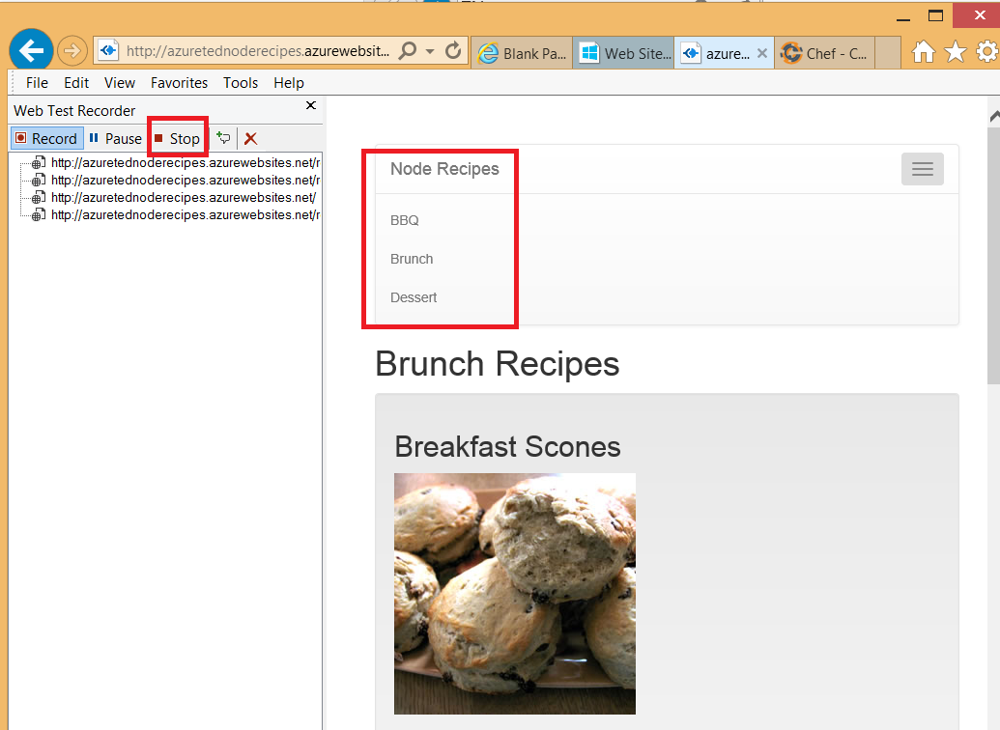

1. The browser window should close, and you should be returned to the **"WebTest1.webtest"** file in Visual Studio.  Visual Studio will automatically run the Web Test looking for any dynamic parameters that it can configure for you.  In our example, it won't find any.  Just let it complete its attempt. 

	> **Note:** Dynamic parameters give you a way to create a dynamic web test that can use different values each time.  This is necessary if you are web testing pages that create, modify, view and delete data.  The IDs, etc would change each time, so we would need a "token" in the URLs and HTTP requests and responses that help us identify and use those dynamic IDs, etc.  
	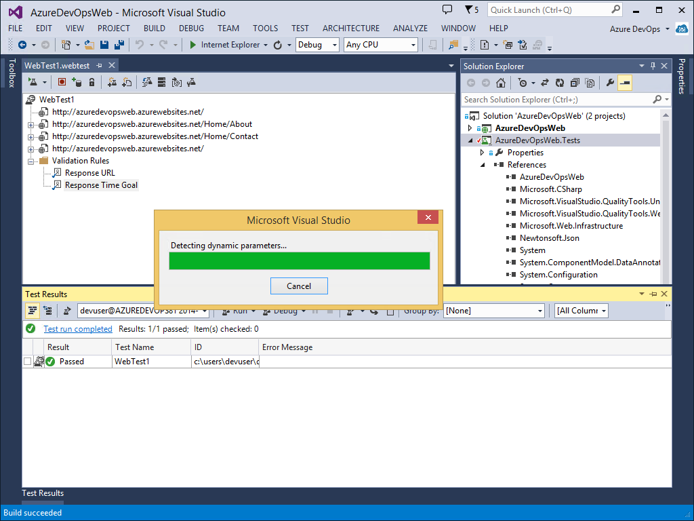

1. In the **WebTest1.webtest"** window, select a URL in the list, and view it's **"Think Time (seconds)"** Property in the **"Properties Window"**. If needed, put appropriate **Think Times** in for each of the URLs.  When you are done, click the **"Run Test"** icon (flask with play arrow) at the top of the **"WebTest1.webtest"** file to run the test.

	> **Note:** Think times allow the test to simulate how long a human might "think" before moving off to a different page.  This allows the web test to more realistically simulate human users.

	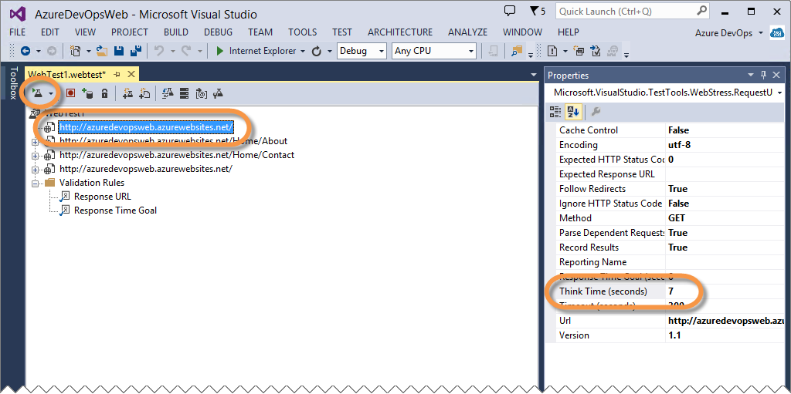

1. Then test will be run, navigating to each of the specified, using the thing times provided.  When it is done, you can select each URL, and view it's results including inspecting the Requests, Repsonses, Context, etc. using the tabs along the bottom of the results window:

	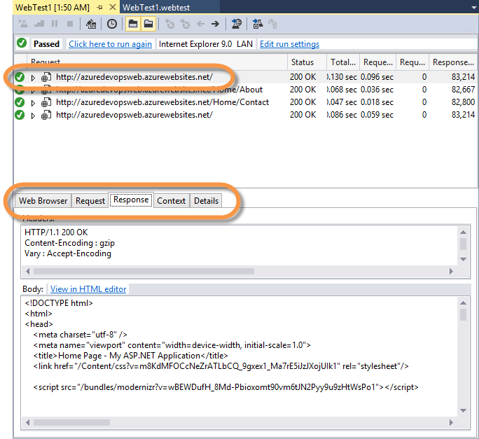

---

<a name="LoadTest" />
### Create a Load Test ###

The **"Web Performance Test"** we just created is interesting, and just scratches the surface of what is available.  [Read the docs](http://msdn.microsoft.com/en-us/library/dn250793.aspx) for more really cool things you can do with Web Performance tests.  

To really stress our site though, we don't want a one-off run of a test.  We want to run the test a bunch of times and as if it was being run by a number of users at once.  For that, we need a **"Load Test"**.

1. In the Visual Studio **"Solution Explorer"**, right click on the **&lt;Your Project Name&gt;.Tests** project, and select **"Add"** | **"Load Test..."** from the pop-up menu:

	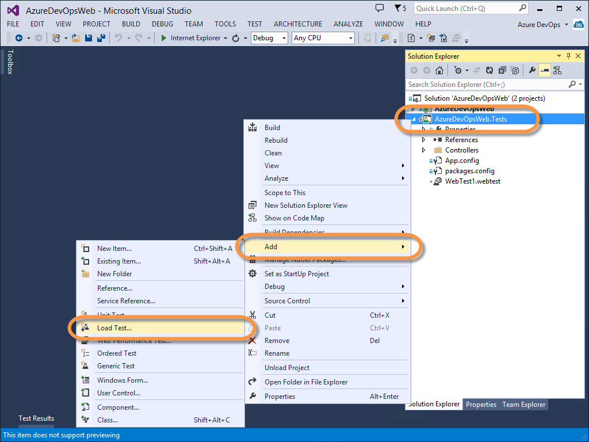

1. The **"New Load Test Wizard"** should appear.  Click **"Next >"** to continue:

	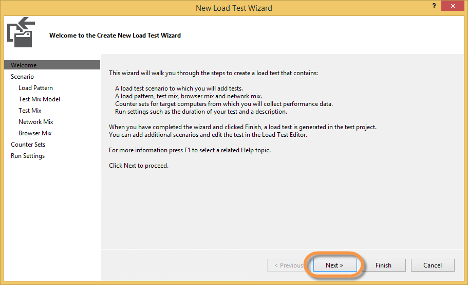

1. On the **"Scenario"** page:
	- Give the Scenario a name
	- Choose **"Use normal distribution centered on recorded think times"**
	- Leave **"Think time between test iterations"** at **0**
	- Click **"Next >"** to continue

	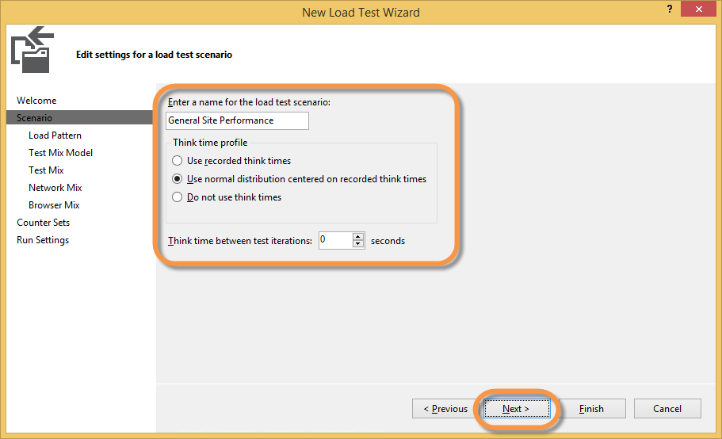

1. On the **"Load Pattern"** page:
	- Select **"Step load"**
	- Start user count: 1
	- Step Duration: 10
	- Step user count: 1
	- Maximum user count: 20

	> **Note:** This starts the load test with one user, then every ten seconds adds one more user, until twenty users have been started. These **"users"** are simulated browser clients running on the dev machine.  If you really wanted to simulate a lot of users (more then twenty), you would need additional machines, or better yet, **"Visual Studio Online"**!

	

1. On the **"Test Mix Model"** page, select the default values and click **"Next >"** to continue:

	> **Note:** This only make sense when you run more than one test as part of the load test.  We will only run our **"WebTest1"** that we created earlier, so there is no need to desribe how to mix them up.  The same test will be run every time. 

	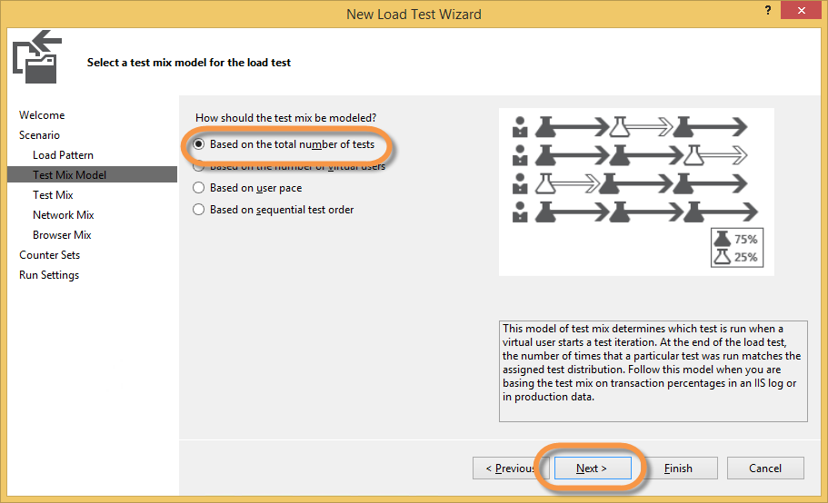

1. On the **"Test Mix"** page, click the **"Add..."** button, then select the **"WebTest1"** test from the list of **"Available Tests" and click the right arrow button to add it to the list of **"Selected Tests", the click **"OK"**

	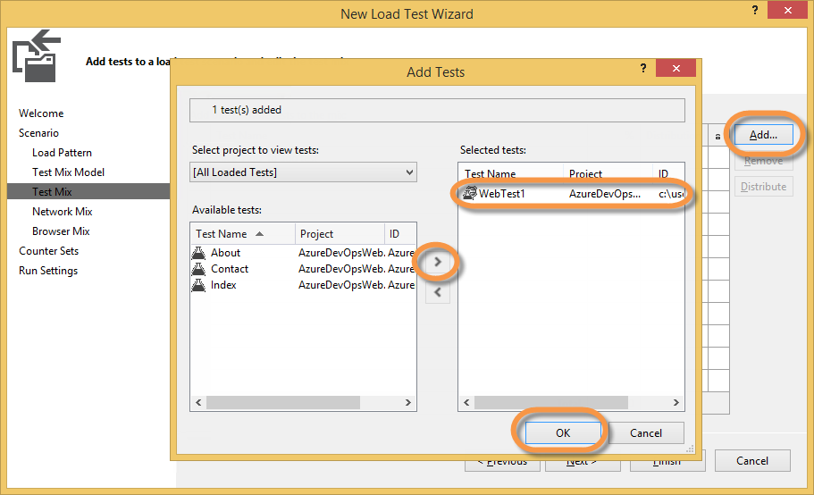

1. Back on the **"Test Mix"** page, click **"Next >"** to continue:

	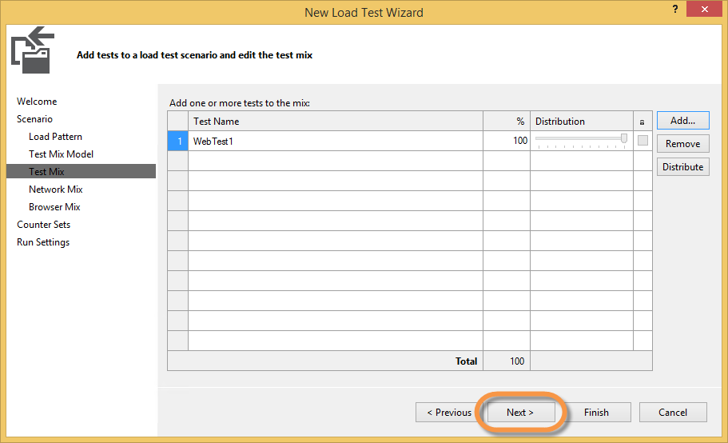

1. On the **"Network Mix"** page, leave the default **"LAN"** Network Type, and click **Next >"** to continue:

	> **Note:** When you run Load Tests in Visual Studio Online, you can only use the **LAN** network type. If you were running elsewhere you could add additional network types, but in this case, we'll leave it at just **"LAN"** and move on:

	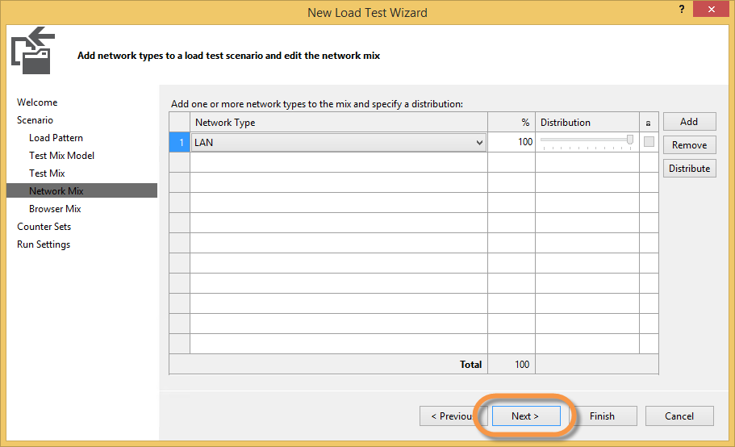

1. On the **"Browser Mix"** page, click the **"Add"** button a few times to add some additional browsers to simulate, and play with the **Distribution** sliders to affect how often each browser is used proportionally, and click **"Next >"** to continue:

	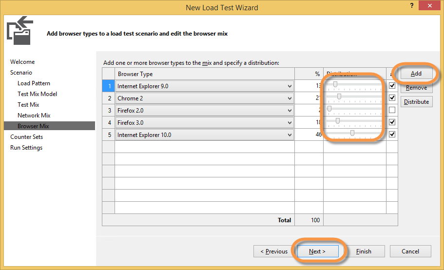

1. On the **"Counter Sets"** page, leave the defaults, and click **"Next >" to continue.

	> **Note:** If you had access to the computer running the web server, you could install the **"Microsoft Monitoring Agent"** on it to allow the collection of performacne counters from the server.  In this demo though, our "web server" is an Azure Web Site, and we can't install the MMA on the Azure Web Site base image at this time.  So for now, we just have to leave the Counter Sets page empty.

	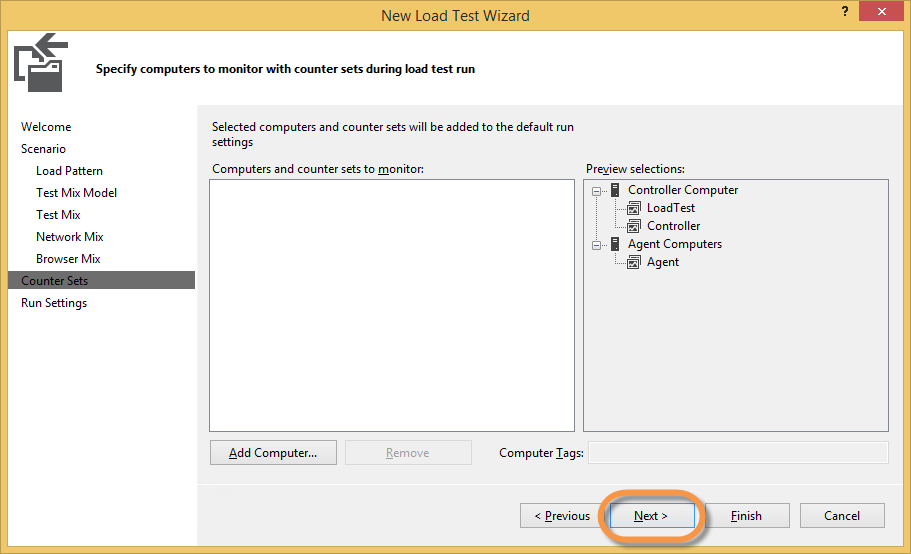

1. Finally, on the **"Run Settings"** page, choose **"Load test duration"** with a 0:0:0 warm-up duration, and a 0:2:0 minute run duration.  Click **"Finish"** to complete the wizard:

	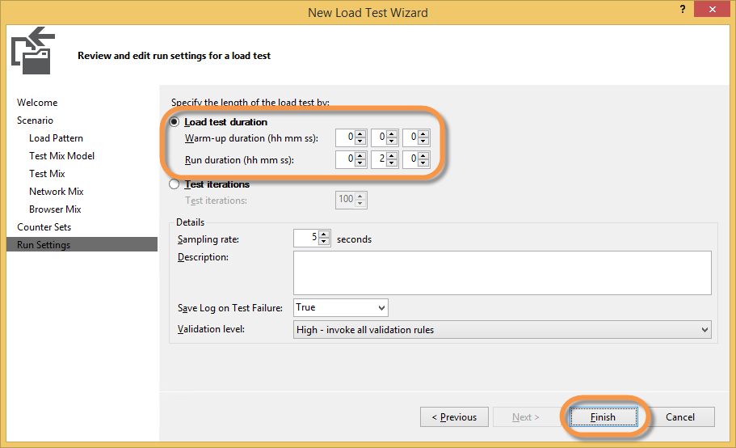

1. You should now see the **"LoadTest1.loadtest"** file open in Visual Studio:

	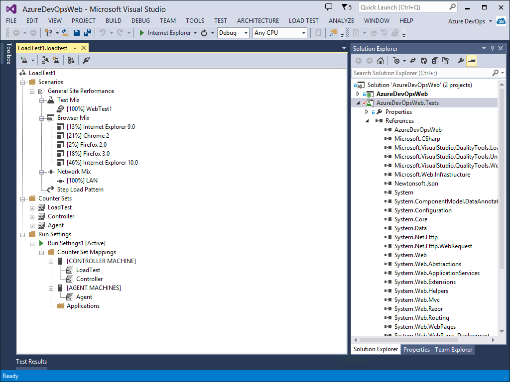

1. Next, we'll allow our load test to collection performance data about the web site using Application Insights.  ***This only works though when the load test is running in Visual Studio Online.***  

1. In the **"LoadTest1.loadtest"** window, expand **"Run Settings"** | **"Run Settings1"** | **"Counter Set Mappings"**, and then right-click on the **"Applications"** node, and select **"Get Performance Data from Application Insights"**:

	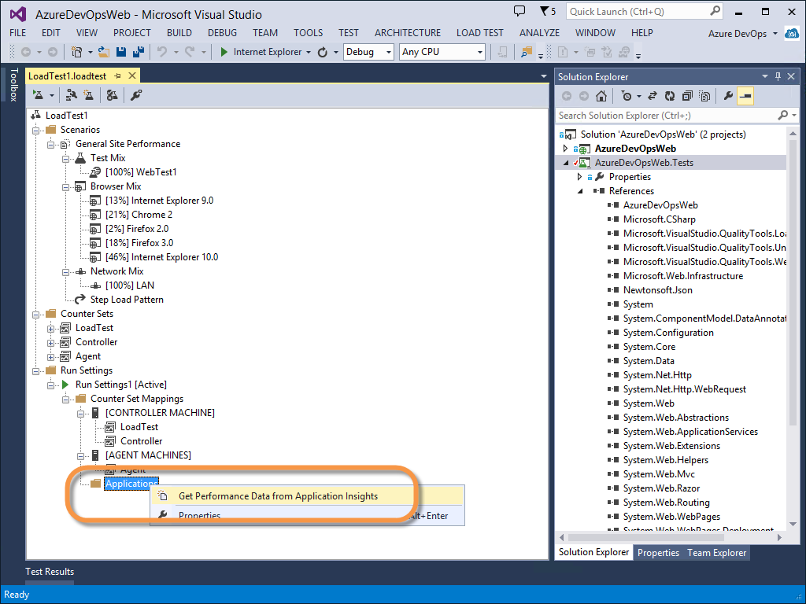

1. In the **"Get Performance Data from Application Insights"** window, turn on the checkbox next to the component for your Web Application, and click **"OK"**

	> **Note:** Recall from before that we are not collection server level performance counters because our site is running on an Azure Web Site, and you can't currently get server level performance counters from an Azure Web Site (hope to see that change in the future).  So, while we can have the load test collect the performance data this way, there won't be any data to collect in our case.

	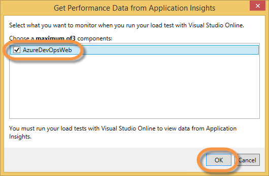

1. ***OPTIONAL - IF YOU ARE PRESSED FOR TIME, YOU CAN SKIP THIS STEP*** - You can run the load test now, but it will consume local resources as it does so.  We should be ok though because we set it to only run for two minutes max, and with a "20 user" maximum load. Along the top of the **LoadTest1.loadtest** file, click the **"Run Load Test"** (**Flask with Play Arrow**) icon to run the test.  

	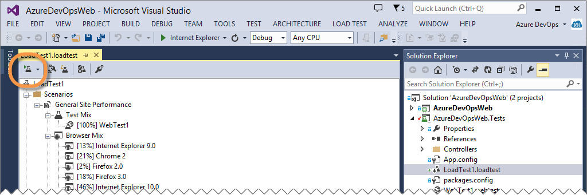

1. You can monitor the test while it runs.  If see an error, it is likely due to the fact that we told it to include performance data from our app via Application Insights, but that doesn't work when the Load Test is being run locally.  Collecting performance data from Application Insights requires that the Load Test be running in Visual Studio online.  

	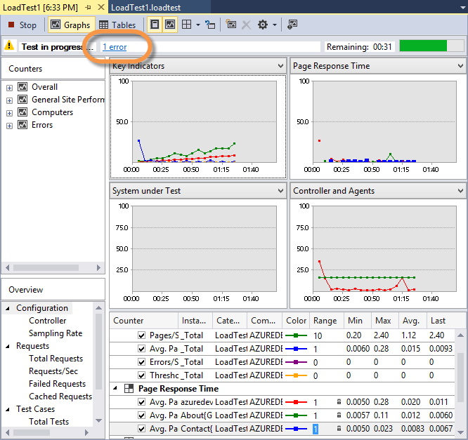

---

<a name="RunLoadTestOnVSO" />
### Run the Load Test using Visual Studio Online ###

1. We see that we CAN run the load test locally, but if we really wanted to stress the website, we would want to hit it with more than just twenty users for two minutes.  If you want to use higher test loads, you could setup your own test controllers and agents, but that is time and resource intensive.  Instead, we will use Visual Studio Online's load testing capability.  To configure that, we need a **"&#42;.testsettings"** file.  Since we added our Web Performance and Load tests to an existing project, one wasn't created for us automatically.  If we had instead added specifically a new **"Web Performance and Load Test Project"** to our solution, a **"Local.testsettings"** file would have been added to our solution for us.  As is, we need to make one.

1. In the Visual Studio **"Solution Explorer"** window, right click the solution, and select **"Add"** | **"New Solution Folder"** from the pop-up menu: 

	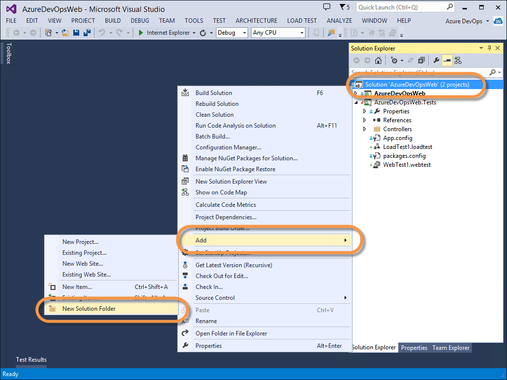

1. Name the new folder, **"Solution Items"**:
	
	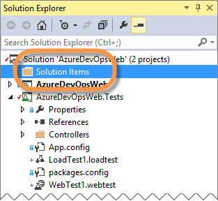

1. Right click the new **"Solution Items"** folder, and select **"Add"** | **"New Item..."** from the pop-up menu:
	
	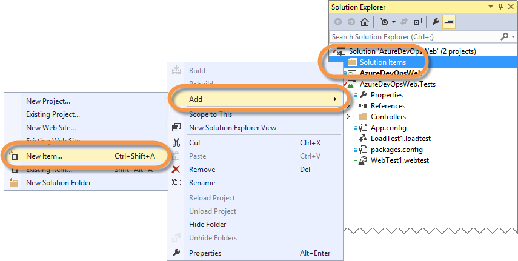

1. In the **"Add New Item - Solution Items"** dialog, select **"Test Settings"** along the left, then, select the **"Test Settings"** project template.  Name the new file **"Local.testsettings"** and click **"Add"** to add the file. 

	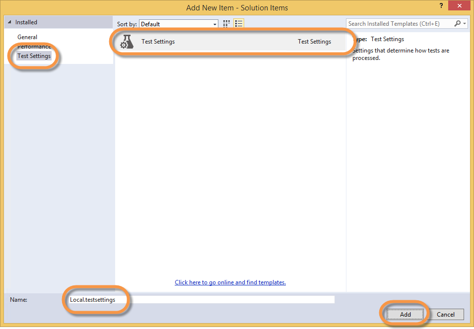

1. A **"Test Settings"** window will appear.  Select the **"Run tests using Visual Studio Oneline"** option.  Then click **"Apply"** and **"Close"** to close the window. 

	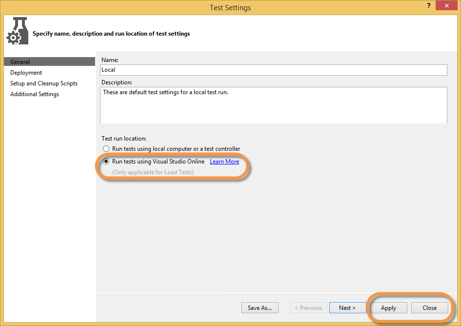

1. Lastly, we need to tell Visual Studio to use the settings in this file when Load Tests are run.  To do so, from the Visual Studio menu bar, select **"TEST"** | **"Test Settings"** | **"Select Test Settings File"**, and then in the **"Open Settings File"** point to the **"Local.testsettings"** file we created previously, and click **"Open"**

	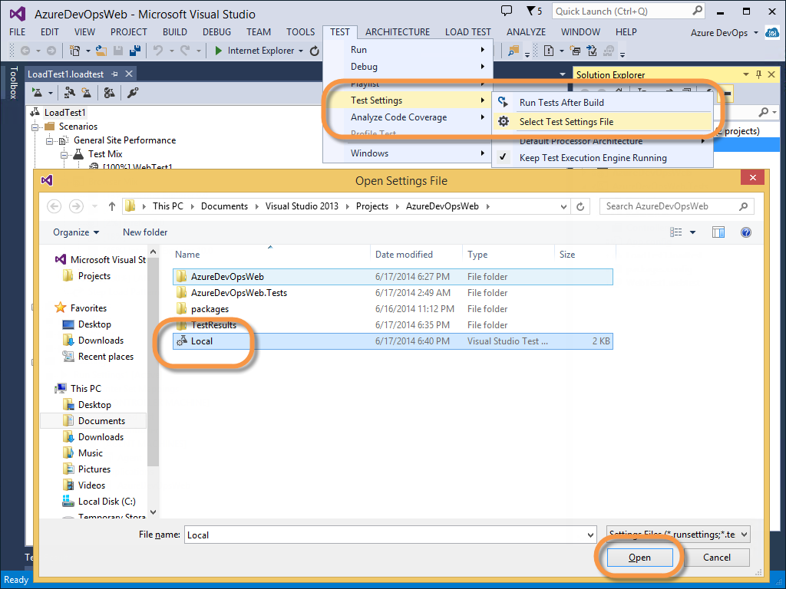

1. Back in the **"LoadTest1.loadtest"** file, click the **"Run Load Test"** (**Flask with Play Arrow**) icon to run the Load Test on Visual Studio Online:

	> **Note:** You could increase the user count, etc, but we will leave it low to keep the demo quick, and to help consume the demonstrators Visual Studio Online resources.  Note also that because the duration of the test is so low (two minutes) You may not collect much useful information from Application Insights because it takes time for that performance data to collect there.

	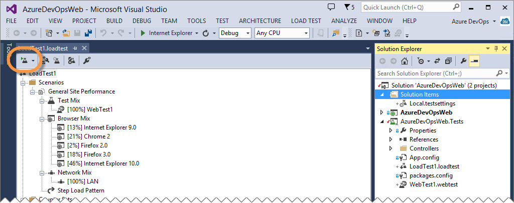

1. You should see the connection initialization with Visual Studio Online start, and within a couple of minutes, the load test should start.  You can switch between the various **Graphs** and **Details** views to monitor its progress:

	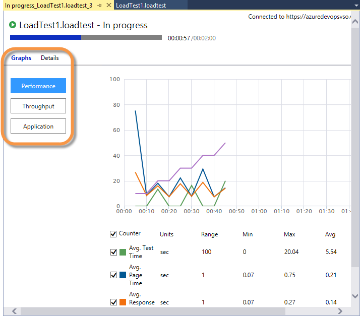

1. The **"Details"** page gives specific details about the test run, including how many virtual user minutes will be used (Each Visual Studio Online account gets 15,000 virtual user minutes a month.  If you need more you can purchase them by linking your Azure and Visual Studio Online accounts, and then configuring the billing through the Azure portal.

	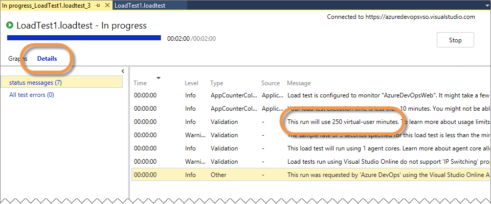

1. ***For comparison purposes only, don't make this change***, here is the same load test, but with a twenty minute duration, and up to two hunder simultaneous users.  It will consume 4000 of my 15,000 virtual user minutes.  FYI, additional Virtual User Minutes can be purchased.  The current price is $0.001USD/minute.  So another 15,000 virtual user minutes would cost $15.00USD.  

	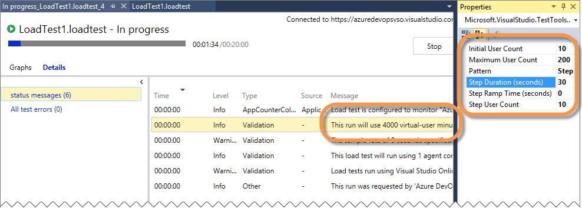

1. When the test is complete, you can download the report from Visual Studio online (note this sometimes takes a couple of minutes before it is available to download, again another reson to have another project with completed load tests that you can view handy):

	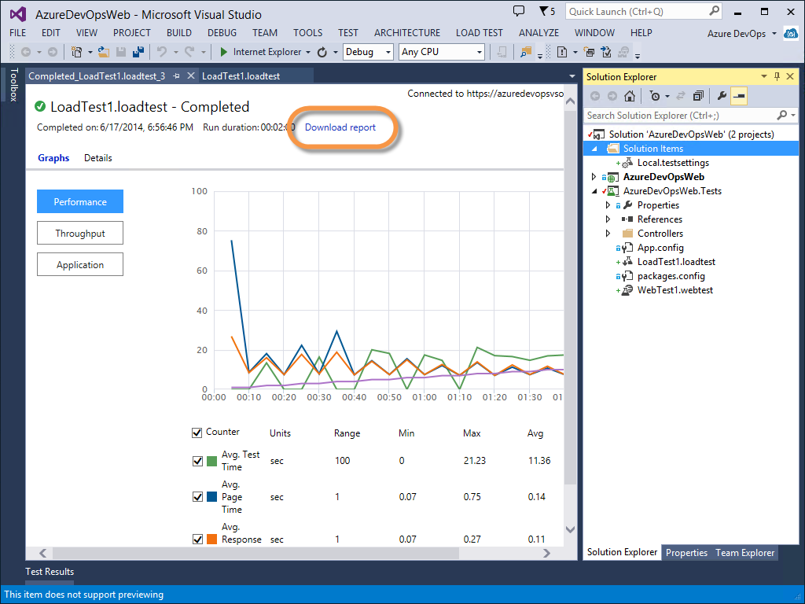

1. Once downloaded you can open the report to view it.  This gives you the same kinds of results you would get if you had run the test locally, or own your own test controller:

	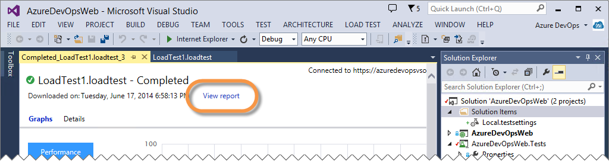

	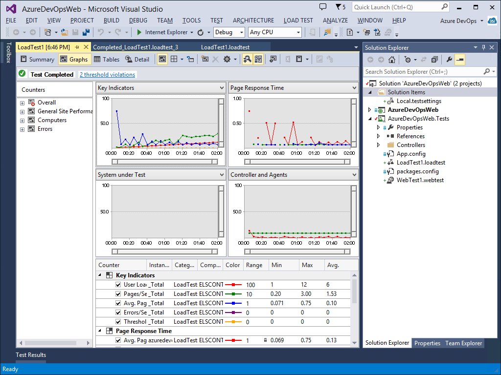

1. Congrats!  You made it through a bunch of stuff in this series of demos.

--- 

<a name="summary" />
## Summary ##

Congraulations!  In this demo you learned the basics of:

- Creating Web Performance Tests
- Creating Load Tests
- Running Load Tests using Visual Studio Online

	
